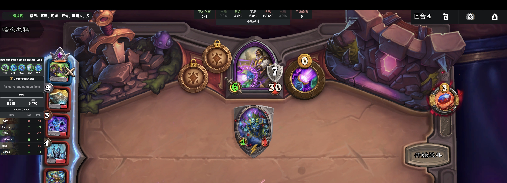
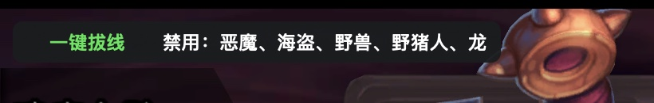

# HSTracker CHS

HSTracker CHS 是基于 [HSTracker](https://github.com/HearthSim/HSTracker) 的 macOS 炉石传说增强版本，主要面向酒馆战棋玩家，集成了 Clash/mihomo 一键拔线、禁用随从面板和 胜率计算 中文界面。
拔线功能借鉴了 https://github.com/z2z63/hearthstone_skipper 大佬的思路。
## 功能特性

- **一键拔线**
  - 通过 Clash/mihomo external controller 断开炉石对局连接，不误杀 Battle.net 会话。
  - 支持悬浮面板、菜单栏和 Dock 菜单入口。
- **禁用随从面板**
  - 左上角显示当前对局被禁用的种族。
  - 文字格式为 `禁用：种族1、种族2…`，白色字体。
- **Bob's Buddy 汉化**
  - 平均伤害、出局、胜利、平局、失败等标签全部中文显示。
  - 补齐了部分缺失的对局状态中文翻译。
- **对局内显示**
  - 左上角合并面板只在真正进入对局后显示。
  - 主菜单、酒馆大厅、排队阶段和对局结束后自动隐藏。

## 截图

### 游戏内整体效果



### 左上角：一键拔线 + 禁用随从



绿色部分是可点击的「一键拔线」，后面白色文字是当前对局禁用的种族。

### Bob's Buddy 中文面板


## 安装

1. 打开 [Releases](https://github.com/alamo68/HSTracker_CHS/releases) 页面。
2. 下载最新版本的 `HSTracker-CHS-*.zip`。
3. 解压后把 `HSTracker.app` 拖入 `/Applications`。
4. 如果 macOS 提示无法打开，右键 `HSTracker.app` → **打开**，或者到「系统设置 → 隐私与安全性」允许打开。

> 当前发布包使用 ad-hoc 签名，未经过 Apple 公证，首次打开可能需要手动允许。

## 使用说明

### 一键拔线

进入酒馆战棋对局后，左上角会出现绿色的「一键拔线」：

1. 点击左上角绿色「一键拔线」即可断开当前对局连接。
2. 也可以通过 HSTracker 顶部菜单的「拔线 → 一键拔线」操作。
3. 还可以右键 Dock 图标，选择「一键拔线」。

#### 配置 Clash/mihomo

推荐使用 **Clash Verge / Clash Verge Rev**，并且必须开启 **虚拟网卡（TUN）模式**。

需要满足以下条件，否则 HSTracker 可能查不到炉石对局连接：

1. Clash Verge 使用 **虚拟网卡模式 / TUN 模式**，让炉石的流量进入 Clash。
2. 在 Clash Verge 的 **全局覆写 / 全局扩展配置 / Merge** 中加入：

```yaml
# 2. 核心控制参数 (直接注入全局主配置)
find-process-mode: always  # 开启全局进程匹配模式
```

`find-process-mode: always` 用于让 Clash 在 connections 接口里返回完整的进程路径；HSTracker 需要用它来区分：

- `Hearthstone.app/Contents/MacOS/Hearthstone` 的对局服务器连接；
- Battle.net 的会话连接。

没有这个参数时，Clash API 可能查不到进程信息，一键拔线会提示：

```text
未找到炉石对局连接
```

配置完成后，在 HSTracker 里继续设置 External Controller：

1. 打开 HSTracker 菜单「拔线 → 设置secret…」。
2. 填写 Clash/mihomo 的 External Controller，例如 `127.0.0.1:9097`。
3. 填写 Secret（没有就留空）。
4. 点击「检测」确认连接成功，然后保存。

拔线只匹配以下对局连接：

- 进程路径以 `Hearthstone.app/Contents/MacOS/Hearthstone` 结尾；
- host 为空的对局服务器连接；
- 优先端口 `1119`。

不会断开 `cn.actual.battlenet.com.cn:1119` 这类 Battle.net 会话连接，避免客户端直接退出。

### 禁用随从面板

进入对局后，左上角会在「一键拔线」后面显示：

```text
禁用：恶魔、海盗、野兽
```

该数据来自 HSTracker 读取的当前酒馆种族池，只在对局内显示。

### Bob's Buddy

Bob's Buddy 面板会自动显示在游戏窗口顶部，包含：

- 平均伤害
- 出局
- 胜利 / 平局 / 失败概率
- 本场战斗 / 上场战斗 / 最终战斗

## 常见问题

### 主菜单/大厅里为什么没有面板？

这是设计行为。左上角合并面板只在实际对局中显示，避免在大厅和排队阶段遮挡界面。

### 点击 HSTracker 界面后追踪面板消失？

检查 HSTracker 设置中的「游戏在后台时隐藏所有追踪器」选项：

- 打开 HSTracker → 设置 → Trackers；
- 关闭「Hide all trackers when game is in background」；
- 这样焦点切到 HSTracker 时，追踪面板仍会保留。

### 拔线失败怎么办？

1. 确认使用 Clash Verge / Clash Verge Rev，并开启了虚拟网卡（TUN）模式。
2. 确认全局覆写里已加入 `find-process-mode: always`。
3. 确认 Clash/mihomo 的 External Controller 和 Secret 正确。
4. 确认炉石流量走了 Clash/mihomo 的 TUN 或系统代理。
5. 确认已经进入实际对局（主菜单/大厅没有对局服务器连接）。
6. 用菜单「拔线 → 检测 Clash 连接」检查连通性。

### macOS 提示应用已损坏或无法验证

这是因为发布包使用 ad-hoc 签名：

```bash
xattr -dr com.apple.quarantine /Applications/HSTracker.app
```

或者右键应用选择「打开」。

## 从源码构建

环境要求：

- macOS
- Xcode
- Swift Package Manager 依赖可联网下载

构建命令：

```bash
xcodebuild \
  -project HSTracker.xcodeproj \
  -scheme HSTracker \
  -configuration Release \
  CODE_SIGNING_ALLOWED=NO \
  build
```

构建产物位于 `DerivedData` 的 `Build/Products/Release/HSTracker.app`。

## 说明

本仓库是基于 HSTracker 的个人增强版，核心记牌和酒馆功能来自 HearthSim/HSTracker，拔线、禁用随从面板和中文界面为本仓库的补充功能。

## License

遵循上游 HSTracker 的许可协议，详见 [LICENSE](LICENSE)。

## 致谢
本项目接受 LINUX DO 社区佬友监督与反馈：https://linux.do/
